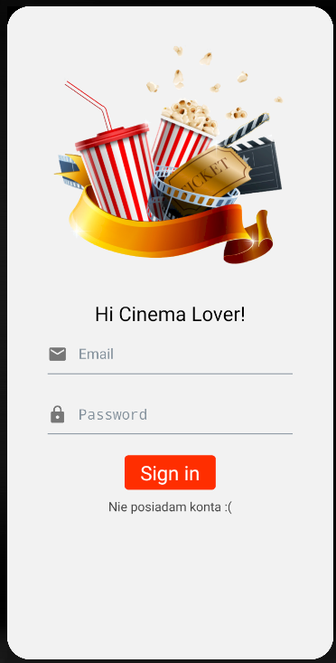
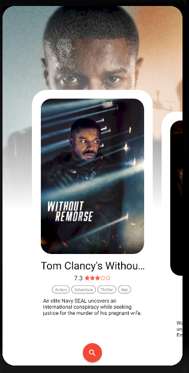
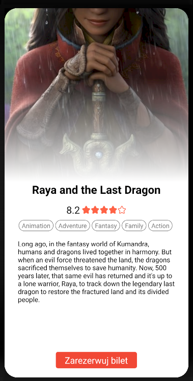
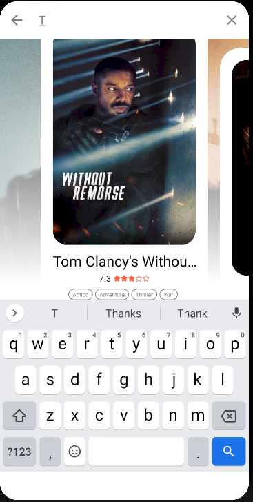
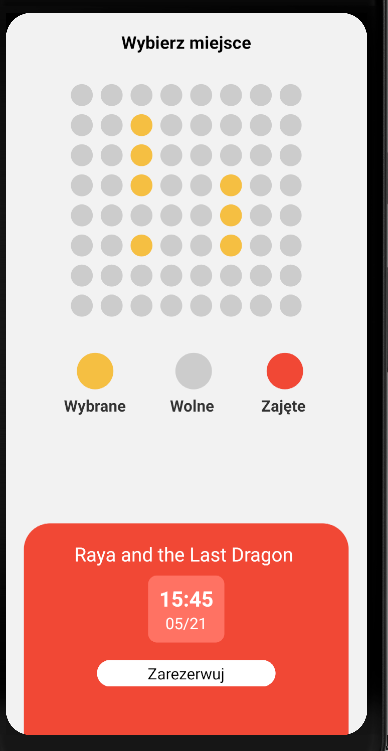
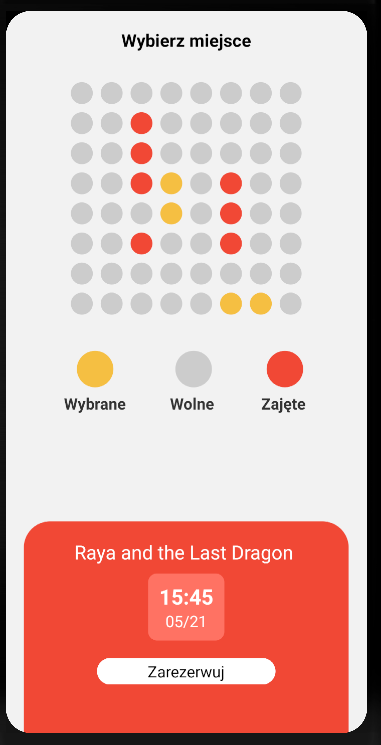

# Awesome Cinema
## Spis treści
* [Technologie](#technologie)
* [Głowne informacje](#głowne-informacje)
* [Opis Aplikacji](#opis-aplikacji)

	

## Technologie

 
 

 
 
 

 

## Głowne informacje
Projekt studencki tworzony w ramach Kursu Aplikacje Mobilne.

Tworzony przez:
* [Maciej Lewandowicz](https://github.com/sasuke5055) (Backend)
* [Piotr Szymański](https://github.com/PitiMonster) (Mobile)

## Opis Aplikacji
Celem projektu było stworzenie aplikacji mobilnej wspierającej system rezerwacji biletów na seanse dla kina. 
Część backendowa została stworzona z wykorzystniem Django, mobilna z wykorzystaniem React native.

Komunikacja aplikacji mobilej z serwerem odbywa się za pośrednictwem architektury REST. 

W trakcie trwania kursu zaimplementowane zostało:
* Tworzenie kont użytkownika i autentykacja za pomocą tokenów
* Wyświetlanie obecnie granych filmów wraz z terminamio seansów, wyszukiwaniem itp
* System sal i biletów - możliwość rezerwacji konkretnych miejsc w salii
* System powiadomień - wiadomości mailowe z biletem w postaci QR kodu po dokonaniu rezerwacji
* Weryfikacja biletów za pomocą czytnika QR i komunikacji z serwerem

### Rejstracja i logowanie:

### Filmy, detale, wyszukiwanie:

### Seanse i rezerwacja biletów:

